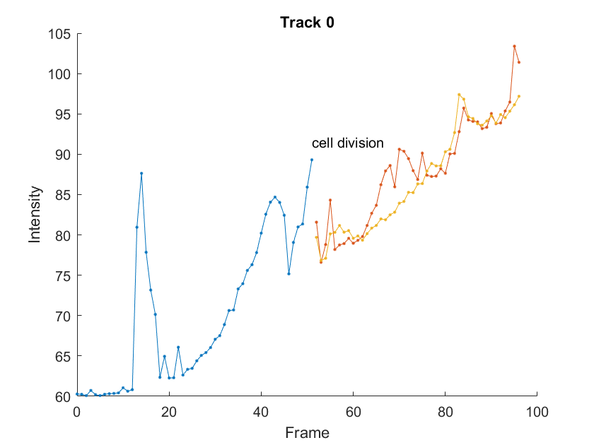

# Matlab_Read_TrackmateXML
Read TrackmateXML files in Matlab using [`readtable`](https://nl.mathworks.com/help/matlab/ref/readtable.html) introduced in [Matlab R2021a](https://nl.mathworks.com/help/matlab/release-notes.html?rntext=&startrelease=R2021a&endrelease=R2021a).

# Examples
## Read a TrackmateXML
```
txml = get_trackmateXML(pth)
```
Reading takes 4 seconds for a 27.3MB TrackmateXML file with 112 tracks, 14055 edges and 40253 spots.
After reading the txml is automatically saved as a `.mat` file with the same name. Subsequent reads will use this file and be much faster.
## Find the start location for track 5
```
[start,finish,split,merge] = txml.analyse_track('Track_5')
[x,y] = txml.getspotXY(start)
```
## Plot the intensity trace for track 0
```
colname = 'MEAN_INTENSITY_1';
track1 = tmx.getTrack('Track_0', false, true);
[start,finish,split,merge] = tmx.analyse_track('Track_0');
clf
hold on
for i = 1:length(track1)
    I = tmx.getColumn(track1{i}, 'MEAN_INTENSITY_1');
    f = tmx.getColumn(track1{i}, 'FRAME');
    plot(f,I,'.-')
end
hold off
ax = gca;
for i = 1:length(split)
    spot = tmx.getspot(split(i));
    text(spot.FRAME, 0.05*diff(ax.YLim)+spot.MEAN_INTENSITY_1, 'cell division')
end
title('Track 0')
xlabel('Frame')
ylabel('Intensity')
```

